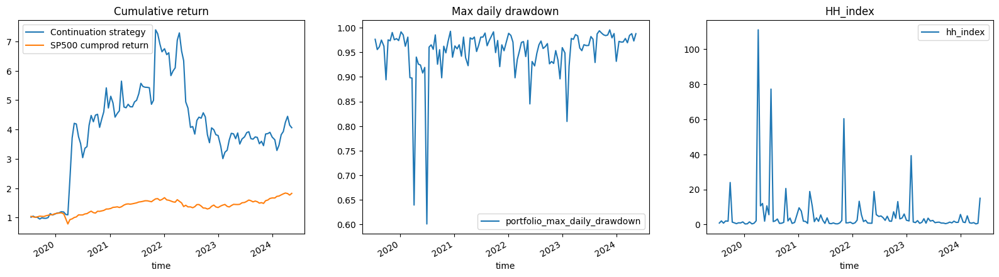
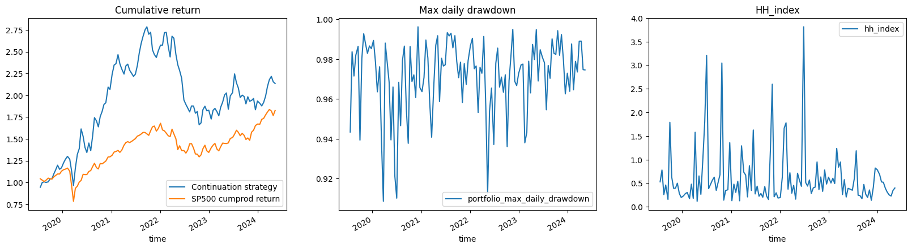

School of Quants. Python project 3. Top-performers continuation of performance strategy. CVAR, Max Sharpe portfolio optimizaiton.

<h4>Strategy</h4>

My strategy is based on trend continuation, best performers will likely remain top-performers for the next couple of weeks and worst will remain the worst. I long a portfolio maximizing Sharpe ratio over the best stocks.
 

Max-Sharpe with best performers and Max-CVAR

<h4>Where ML &#128544</h4>

Whatever I tried I saw nothing better that a coinflip 50-50, this is understandable given that we deal with financial data most of which is generated by unit root processes. 
  I think ML could be used when there is actually something to detect, like manipulation in pumps and dumps in cryptocurrency markets (my current project), 
  there I see how one can use ML/DL for classification and therefore use the logits for some sort of portfolio weights. We could have trained a model prediciting returns in 14 days, 
  but I bet it would have been total garbage.

<h4>Train 30 days use for 10 days. Max Sharpe using top-performers</h4>

   

<h4>Train 90 days use for 14 days. Max CVAR using top-performers</h4>

   

